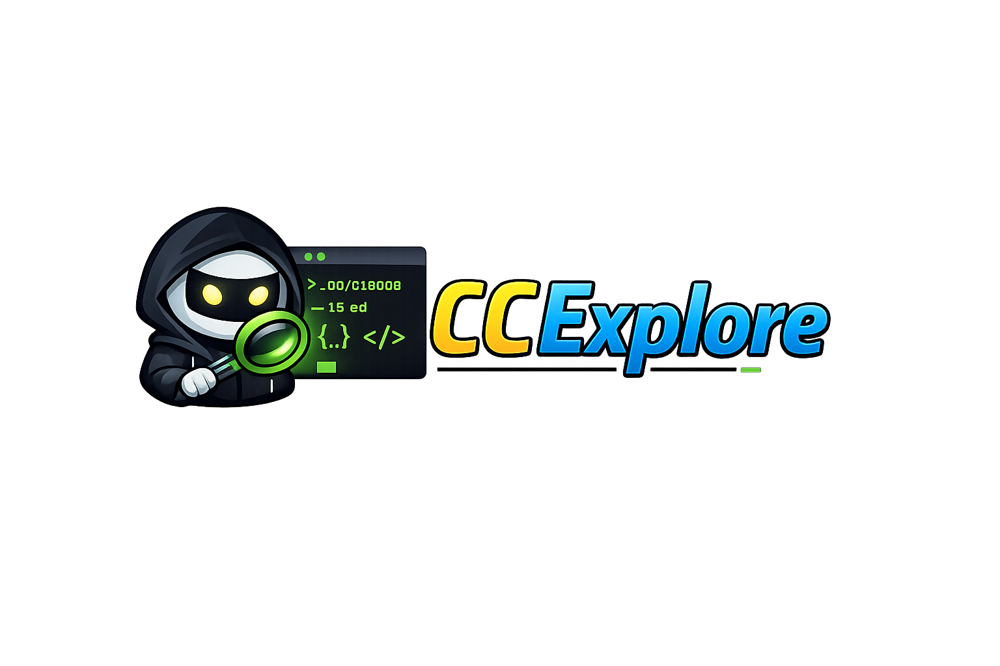

# CCExplore



Explore your Claude Code history. A local web app that indexes and browses your
Claude Code conversations, plans, todos, shell snapshots, and file history.

## Prerequisites

- [Go](https://go.dev/) 1.25+
- [Node.js](https://nodejs.org/) (for Tailwind CSS build)
- [pnpm](https://pnpm.io/)
- [just](https://github.com/casey/just) (task runner)

Or use [Nix](https://nixos.org/) with `nix develop` for a complete dev environment.

## Setup

```sh
pnpm install
```

## Usage

```sh
# Index and start the server
just dev

# Or build the binary
just build
./cmd/ccexplore/ccexplore --open
```

The server reads Claude Code data from `~/.claude` and writes an index to
`$TMPDIR/.ccexplore`. On subsequent runs, use `--skip-index` to skip re-indexing.

### CLI flags

| Flag           | Default              | Description                        |
| -------------- | -------------------- | ---------------------------------- |
| `--port`       | `3000`               | Server port                        |
| `--claude-dir` | `~/.claude`          | Source directory (Claude data)     |
| `--data-dir`   | `$TMPDIR/.ccexplore` | Indexed data output directory      |
| `--skip-index` | `false`              | Skip indexing, serve existing data |
| `--index-only` | `false`              | Index and exit                     |
| `--open`       | `false`              | Open browser after starting        |

## Development

```sh
# Watch CSS changes
just css-watch

# Run dev server
just dev

# Run all tests
just test

# Run unit tests only
just test-unit

# Run e2e tests only
just test-e2e

# Lint
just lint

# Format
just format
```

## What it indexes

- **Projects** - Conversations grouped by project directory
- **Plans** - Markdown plan files from Claude sessions
- **Shell Snapshots** - Shell environment captures
- **Todos** - Task lists from Claude sessions
- **File History** - File backups from conversations
